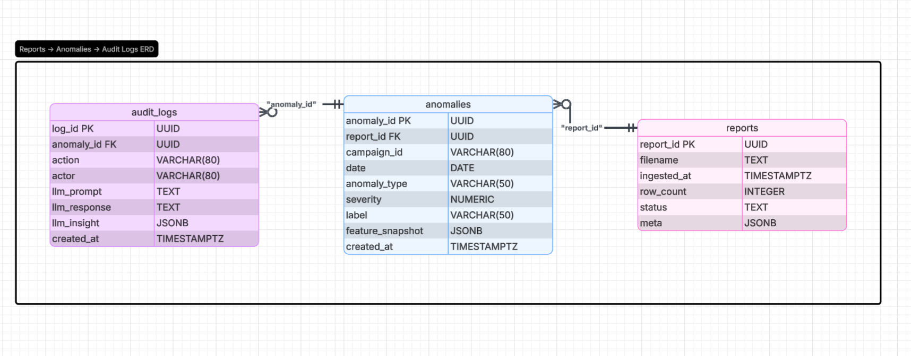

# Specifications.

## 1. Entities and model.

For this implementation we will use SQL DB. We are going to define three entities for rapid prototyping. The entities are `audit_logs`, `anomalies`, `reports`

### Entity Diagram

## 2. What to expect from this.

- This is a campaing guardian, as the name suggest we will detect anomalies on current amazon PPC campaings, so the user will received : All detected anomalies groupBy campaing, An insight for each campaing anomaly, a LLM suggestions to act upon the anomalies.

- We will label the anomalies, CRITICAL, HIGH, MEDIUM AND LOW. So that a user can act on his preferences.

- We will audit each step: anomalies detection, llm response, user's actions.

- We will use rule based and statistical methods to detect anomalies. LLM to generate an insight.

- We will build an MCP to act on detected anomalies. So when a user decided to act on one of the anomalies, then the agent can perform an action on the campain (lower the bid, pause the campaing...etc.)

- A dashboard, focusing on decision fatigue, so the user won't fatigue during his audits. (For larger campaings)

## 3. What not to expect.

- We are not building an autonomous agent, all actions perform are going to be approved by a human.
- We are not building a monitoring tool, this is an audit tool.
- A machine learning model

## 4. How success is measured.

We will measure its success if:

- Is easy to use: The user is not fatigue by the amount of information
- Is informative: Is it accurate? Is it missing something? Can the user act on the information provided by the tool? it feels natural to use this?
- Scalability and easy to approach: If the team can understand the workflow, if other team members can dive into the codebase without feeling daunted.
- Is there any critical bug? How many of them are they?
- It does what it claims to do. If it does not audit, then we are not delivering good material
- How much the tool is helping the customer? Are they improving their metrics by our insights? How much revenue has they made? How much spends have they cut using out tool?

## 5. Assumptions

- All campaings values are not negative
- We have sufficient data to provide good responses/All Campaings store the same columns
- User based is lnot large enough to make the endpoint fail.

## 6. Excluded features

- Machine Learning model
- Enrich data for another statistic layer
- It would be nice to have audits store on a NoSql and a sql for anomalies, reports, users. A hybrid approach
- Authentication/Authorization
- LLM ROUTER
- RAG
- Queues
- RATE LIMIT
